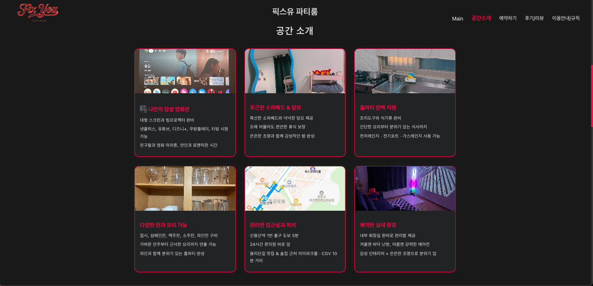

<!-- prettier-ignore-start -->

# FIX YOU Party Room Homepage

A custom-built React homepage for a real-world party room business.  
Designed and developed from scratch to express the unique vibe of the space—warm, cozy, and emotional—while making information and reservations intuitive for users.

---

## Project Overview

FIX YOU Party Room is a small rental venue designed for couples or small groups seeking a private retreat: for movie nights, special occasions, or simple downtime.  
As both the **owner** and **developer**, I set out to create a site that reflects this atmosphere — blending emotional design with practical functionality.

### Key Project Goals

- Build a **real business website** from scratch using React (no templates or UI kits).
- Express the **room’s ambiance** through visuals, copy, and layout.
- Enable **easy, error-free reservations** via a live calendar system.
- Practice and showcase the full process from **planning → design → development**.

---

## Key Features

### Reservation Calendar

Live booking status is integrated via an iCalendar feed using **FullCalendar**, allowing guests to view up-to-date availability directly on the site.

### Room Introduction

A sectioned, visual layout that highlights key features — projector, cozy furnishings, mood lighting — with real photos to build trust.

### Usage Rules & Pricing

Clear presentation of house rules (max occupancy, prohibited items) and a simple, at-a-glance **pricing chart** for different days and times.

### Customer Reviews

A mixed media gallery combining guest testimonials and real photos, emphasizing authenticity and customer satisfaction.

### Emotional User Experience

Responsive layouts for desktop and mobile, **scroll-based navigation**, and **subtle animations** were used to reinforce the “healing, cozy” vibe.

---

## Technology Stack

| Purpose         | Tools                                    |
| --------------- | ---------------------------------------- |
| Frontend        | React.js (Vite setup)                    |
| Styling         | CSS Modules (per section)                |
| Calendar        | FullCalendar + iCalendar API Integration |
| UX / Animations | React Scroll, Flexbox/Grid CSS           |
| Assets          | All images stored locally (no CDN used)  |

---

## 📁 Folder Structure

```
src/
├── assets/               # All images used in the site
│   ├── p1.jpg ~ p11.jpg  # Room photos and UI images
│   ├── s1.png ~ s5.png   # Screenshots (for README)
│   ├── price.png         # Price chart image
│   └── top.png           # Logo image
├── components/           # Reusable UI components
│   ├── Header.jsx
│   └── Footer.jsx
├── sections/             # Page sections (modular)
│   ├── AboutSection.jsx
│   ├── MainSection.jsx
│   ├── ReservationSection.jsx
│   ├── ReviewsSection.jsx
│   └── RulesSection.jsx
├── styles/               # CSS Modules (per section/component)
│   ├── AboutSection.css
│   ├── Footer.css
│   ├── Header.css
│   ├── MainSection.css
│   ├── ReservationSection.css
│   ├── ReviewsSection.css
│   └── RulesSection.css
├── App.jsx               # Main component (renders all sections)
└── main.jsx              # Entry point (ReactDOM render)
```


## 📷 Screenshots

### Home Page


### Introduction



### Reservation Calendar & Pricing


### Reviews Section


### Rules


---

## Development Process & My Role

This was my **first end-to-end React project** for a real-world service. I handled everything from design planning to coding and content creation.

### 🔹 Component-Based Architecture

All UI sections were built as independent, reusable components (Nav, Calendar, Info, Pricing, Reviews), improving clarity and maintainability.

### 🔹 External API Integration

Reservation data was fetched via an **iCalendar API**, parsed manually, and rendered dynamically using FullCalendar, ensuring automatic real-time booking info.

### 🔹 Responsive & Emotional UI

I crafted layouts for both desktop and mobile using **vanilla CSS (Modules)** — no external frameworks — while maintaining a consistent emotional tone across devices.

### 🔹 User Feedback & Iteration

I conducted small user tests with real guests and iterated on content placement, navigation flow, and image layout based on real feedback.

> Everything — from design to code — was built from scratch, with no templates or UI kits.  
> The result is a **bespoke, emotionally resonant website** tailored exactly to the needs of my space.

---

## Deployment Note

This project is **not publicly deployed**.  
It serves as an internal operational website for FIX YOU Party Room.  
All code and assets are version-controlled here for future updates and scaling.

---

## What I Learned

Through this project, I learned how to:

- Plan, design, and build a complete business site as a **solo developer**.
- Work with **asynchronous data and API integration** in React.
- Create a **modular, scalable frontend architecture** for real-world use.
- Design for both **usability and emotional impact**, relying only on self-made resources.

This project sharpened my ability to take an idea from concept to execution, balancing both technical and design goals for an actual service.

<!-- prettier-ignore-end -->
